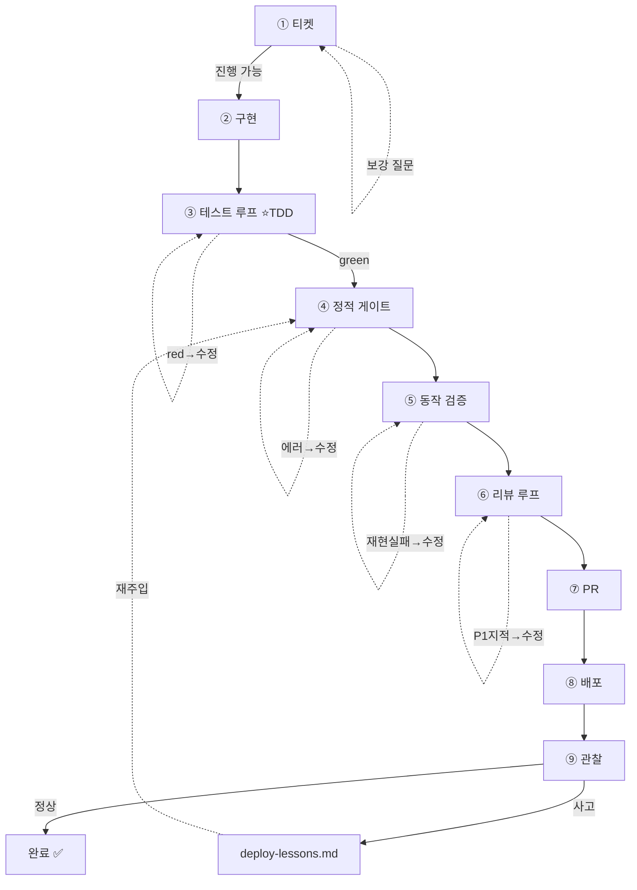

# 시스템 루프 설계 — develop OS

> 2026-06-11 정리. "시스템 루프 설계하기" 연습(목표·장치·지표)을
> 내 개발 OS(`develop` → `code-review` → PR → deploy)에 적용.
> **핵심 관점: 루프는 별도 스킬이 아니라 파이프라인 각 단계에 박힌 "가드 루프"다.**

## 목표

각 단계를 "한 번 해보고 끝"이 아니라 **기준을 통과할 때까지 반복하는 루프**로 만들고,
끊긴 다음 칸(deploy)까지 루프로 잇는다.

---

## 1. 전체 OS 루프 (한눈에)

각 단계의 `↺`는 "작업 → 게이트로 측정 → 못 넘으면 수정 → 다시"라는 가드 루프.

```
 ┌──────────────────────────── develop OS ────────────────────────────┐

  ① 티켓          ↺ 보강 질문 (ticket-analyst) → "진행 가능"까지
   │
   ▼
  ② 구현
   │
   ▼
  ③ 테스트 루프    ↺ red → 코드 수정 → green까지              ⭐ TDD
   │ green
   ▼
  ④ 정적 게이트    ↺ 빌드·린트·타입 에러 → 수정 → 0까지
   │
   ▼
  ⑤ 동작 검증      ↺ 재현 실패 → 수정 → 정상 경로까지 (verify)
   │
   ▼
  ⑥ 리뷰 루프      ↺ P1 지적 → 수정 → 지적 0까지 (code-review)
   │
   ▼
  ⑦ PR ─▶ ⑧ 배포 ─▶ ⑨ 관찰
                      ├─ 정상 ─▶ 완료 ✅
                      └─ 사고 ─▶ deploy-lessons.md
                                  ↺ 다음 배포 프리플라이트에 재주입 → ④~⑥

 └─────────────────────────────────────────────────────────────────────┘
```

같은 그림 (GitHub·미리보기에서 렌더링):



---

## 2. 가드 루프 일반형 (모든 단계의 공통 골격)

```
   작업
    │
    ▼
   게이트 (통과 기준)
    ├─ 통과 ─▶ 다음 단계
    └─ 실패 ─▶ 수정 ─▶ ↺ (작업으로)
```

게이트 없는 단계는 "한 방에 끝"을 가정 — 거기가 결함이 새는 지점이다.

### 단계별 루프 카탈로그

| # | 루프 | 무엇을 반복 | 종료조건 | 누가 |
|---|------|------------|---------|------|
| ① | 티켓 게이트 | 분석 → 보강 질문 → 답변 | "진행 가능" | 사람+AI *(존재)* |
| ③ | **테스트 (TDD)** | 테스트 작성 → 실행 → 실패 시 수정 | 전부 green | AI ⭐ |
| ④ | 정적 게이트 | 빌드·린트·타입 → 에러 수정 | 에러 0 | AI |
| ⑤ | 동작 검증 | 앱 실행 → 동작 확인 → 수정 | 정상 경로 재현 | AI+사람 *(`verify`)* |
| ⑥ | 리뷰 | code-review 지적 → 수정 → 재리뷰 | P1 지적 0 | AI *(일부 존재)* |
| ⑥+| 배포 프리플라이트 | lessons 체크 대조 → 보강 | 과거 패턴 충돌 0 | AI |

---

## 3. 테스트 루프 (TDD) — ③ 가장 먼저 박을 루프

"테스트 작성하고 실패하면 성공할 때까지 수정한다"가 정확히 이것.

```
   의도 파악
    │
    ▼
   테스트 작성        ← "있어야 할 동작" = 통과 기준을 먼저 고정
    │
    ▼
   실행
    ├─ 🟢 green ─▶ 다음 게이트
    └─ 🔴 red ──▶ 코드 수정 ─▶ ↺ (실행으로)

   ⛔ 안전장치: 상한 N회 · 3회 연속 같은 실패 → 멈춤 → Draft PR + 보고
```

`code-review` 스킬이 이미 쓰는 "TDD 역전(통과 기준을 먼저 세우고 코드를 역검증)"을,
테스트 루프는 **실행 가능한 테스트로 고정**해 사람 판단 없이 green/red로 수렴시킨다.

---

## 4. 두 종류의 루프 — 수렴 vs 개선 (ralph 재검토)

```
 ══ 수렴 루프 (convergence) ══      pass/fail 명확 · 통과하면 종료
   작업 ─▶ 게이트
            ├─ 통과 ─▶ 종료 ✅
            └─ 실패 ─▶ 수정 ─▶ ↺
   예) 테스트 · 린트 · 리뷰
   ▶ develop에 인라인 (가벼운 재시도면 충분)

 ══ 개선 루프 (optimization) ══     정답 없음 · 지표를 더 낫게
   지표 측정 ─▶ 더 나은가?
                ├─ 목표/정체 ─▶ 종료
                └─ 아니오 ─▶ 시도 ─▶ lessons.md 누적 ─▶ ↺ (독립 컨텍스트 재주입)
   예) E2E 시간↓ · 스킬 트리거 정확도↑
   ▶ ralph 메커니즘 (독립 컨텍스트·lessons·judge가 정당화되는 유일한 곳)
```

> **결론**: `ralph`를 사용자가 직접 부르는 최상위 스킬로 둘 필요는 약하다.
> 흔한 케이스(수렴 루프)는 develop 단계의 가드 루프로 충분하고,
> ralph는 *드문 개선 루프*를 위한 **내부 메커니즘**으로 남긴다.

---

## 5. 자율 개선 장치 — deploy-lessons (자산 축적형)

수렴 루프는 "오늘 통과"만 본다. *내일 더 나아지려면* 겪은 걸 남겨야 한다.

```
   배포 ─▶ 관찰
            ├─ 정상 ─▶ 완료
            └─ 사고
                 │
                 ▼
            교훈 추출   [ 증상 · 근본 원인 · 놓친 신호 · 다음 배포 체크 1줄 ]
                 │
                 ▼
            deploy-lessons.md   (SSOT, 도메인 문서처럼)
                 │
                 ▼
            다음 배포 프리플라이트에서 대조 ─▶ 과거 패턴 충돌? ─▶ 보강  ↺
```

테스트 루프가 *코드 결함*을 green/red로 수렴시키듯,
deploy-lessons는 *운영 사고*를 "다음 배포 전 체크"로 자산화한다.

---

## 6. 정량 지표 — 3층

```
  메타 ┃ (c) 재발률    = 같은원인 재발사고 / 전체사고     → "스스로 나아지나?"
  ─────╋──────────────────────────────────────────────────────────────
  루프 ┃ (b) 1차통과율 = 첫 green PR / 전체 PR           → "루프가 효율적인가?"
  ─────╋──────────────────────────────────────────────────────────────
  결과 ┃ (a) 배포건강도 = 1 − 실패배포 / 전체배포          → "오늘 건강한가?"
```

- **(a)** 결과 — DORA *변경 실패율*과 동일. 높을수록 한 번에 잘 나간다.
- **(b)** 효율 — 가드 루프가 첫 시도에 통과하는 비율. 낮으면 구현/테스트가 약함.
- **(c)** 메타 — 5번 자산화가 *진짜로* 작동하면 0으로 수렴.

---

## 한 줄 요약

루프는 **각 단계에 박힌 가드 루프**(테스트·린트·검증·리뷰·프리플라이트),
**수렴 루프는 develop 인라인 · 개선 루프만 ralph 메커니즘**,
deploy 칸은 **`deploy-lessons.md`로 사고를 자산화**,
작동 여부는 **1차 통과율·사고 재발률**로 본다.

## 다음 단계

1. develop에 **테스트 루프(③)** 먼저 박기 — 상한 N회 + 3회 정체 시 Draft PR 종료
2. `ralph`를 최상위 스킬 → 내부 메커니즘으로 재배치 (개선 루프 전용)
3. 정적 게이트(④)·동작 검증(⑤·`verify`)·리뷰(⑥)를 단계 게이트로 명문화
4. `deploy` 스킬 초안 + `deploy-lessons.md` 스키마
5. 지표 (a)(b)(c) 집계 위치 (PR 라벨? 배포 로그? 수기부터)
